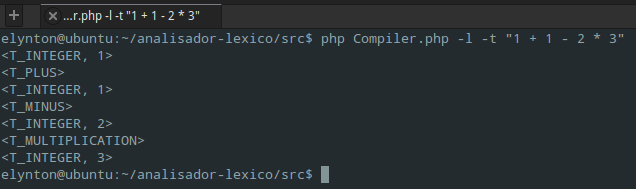
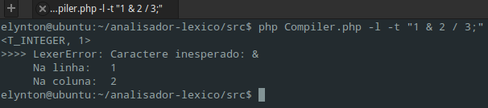
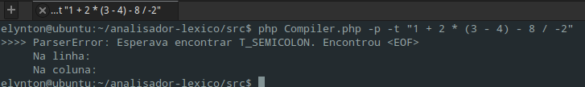
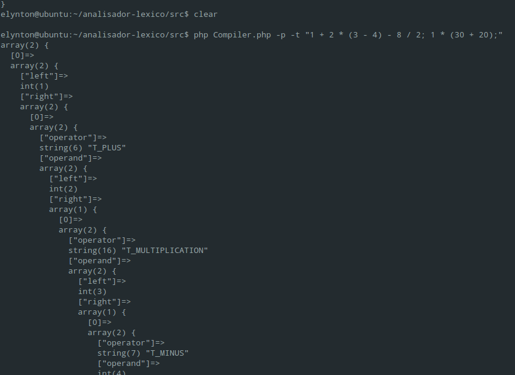
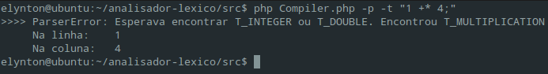

### Analisador sintático e semântico de expressões aritméticas

- **Disciplina**: Compiladores
- **Professor**: Gilsiley Darú
- **Autores**: Elynton Fellipe Bazzo e Andrei Siqueira

### Sobre o projeto

Um analisador de expressões aritméticas, com suporte a precedência de operadores, operadores unários e binários e números de ponto
flutuante, podendo dar a saída em tokens do analisador léxico, e em árvore (sem notação polonesa reversa) do parser. O projeto foi escrito
100% manualmente e em PHP. O parser é *predictive top down recursive descent parser* baseada em uma gramática formal EBNF citada nos fontes.

### Uso do compilador

Tendo o PHP instalado, abra o prompt de comando, acesse a pasta `src` do projeto e use:

`php Compiler.php <tipo_analise> <tipo_entrada> <entrada>`

Onde:
- **`tipo_analise`** (`-l` ou `-p`) remete a qual camada fica encarregada a saída, se ao lexer, gerando os tokens, ou ao parser, gerando
a árvore de sintaxe abstrata infixa.
- **`tipo_entrada`** (`-f` ou `-t`) remete ao tipo de entrada. `-f` para arquivo e `-t` para texto.
- **`entrada`** remete à fonte de análise, que pode ser uma expressão ou o nome de um arquivo.

Exemplos de uso:

`php Compiler.php -l -f arquivo.txt`
`php Compiler.php -p -t "1 + 1 * (2 - -4) / 3; 2 + 2;"`

### Exemplos de uso

#### Lexer

`php Compiler.php -l -t "1 + 1 - 2 * 3"`



`php Compiler.php -l -t "1 & 2 / 3;"`


#### Parser

`php Compiler.php -p -t "1 + 2 * (3 - 4) - 8 / 2"`


`php Compiler.php -p -t "1 + 2 * (3 - 4) - -8 / 2; 1 * (30 + (20))"`



**Saída representada da árvore**:
```js
array(2) {
  [0]=>
  array(2) {
    ["left"]=>
    int(1)
    ["right"]=>
    array(2) {
      [0]=>
      array(2) {
        ["operator"]=>
        string(6) "T_PLUS"
        ["operand"]=>
        array(2) {
          ["left"]=>
          int(2)
          ["right"]=>
          array(1) {
            [0]=>
            array(2) {
              ["operator"]=>
              string(16) "T_MULTIPLICATION"
              ["operand"]=>
              array(2) {
                ["left"]=>
                int(3)
                ["right"]=>
                array(1) {
                  [0]=>
                  array(2) {
                    ["operator"]=>
                    string(7) "T_MINUS"
                    ["operand"]=>
                    int(4)
                  }
                }
              }
            }
          }
        }
      }
      [1]=>
      array(2) {
        ["operator"]=>
        string(7) "T_MINUS"
        ["operand"]=>
        array(2) {
          ["left"]=>
          int(8)
          ["right"]=>
          array(1) {
            [0]=>
            array(2) {
              ["operator"]=>
              string(10) "T_DIVISION"
              ["operand"]=>
              int(2)
            }
          }
        }
      }
    }
  }
  [1]=>
  array(2) {
    ["left"]=>
    int(1)
    ["right"]=>
    array(1) {
      [0]=>
      array(2) {
        ["operator"]=>
        string(16) "T_MULTIPLICATION"
        ["operand"]=>
        array(2) {
          ["left"]=>
          int(30)
          ["right"]=>
          array(1) {
            [0]=>
            array(2) {
              ["operator"]=>
              string(6) "T_PLUS"
              ["operand"]=>
              int(20)
            }
          }
        }
      }
    }
  }
}
```

`php Compiler.php -p -t "1 +* 4;"`

